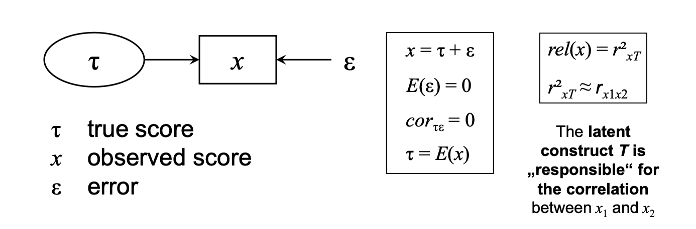

```{r package-options, include=F}
knitr::opts_chunk$set(comment = "", fig.align='center')
```

# Packages

```{r setup, results='hide', message=F, warning=F}
# basic tools 
library(tidyverse)

# checking data
library(MVN)
library(correlation)
library(performance)
library(parameters)
library(insight)

# building the models
library(lavaan)

# cheking the models
library(semTools)

# model visualization
library(semPlot)
library(semptools)
```

# Data

```{r}
ESS07 <- read.csv("../data/ESS07.csv")
```


# Confirmatory factor analysis

Many variables in the social and behavioral sciences represent hypothetical constructs (e.g., traits, attitudes, values)

Direct access to hypothetical constructs is rare. Many constructs can only be captured by (multiple) observable indicators (e.g., in a questionnaire)

It is assumed that such indicators are manifestations of hypothetical constructs - Manifest indicators: directly observable - Latent variables: not directly observable

We need a model that is able to conceptualize the relationship between manifest indicators and latent variables

The classic test theory @novick_axioms_1966

```{r, fig.align='center', out.width="60%", echo=F}

```

## Procedure

### Step 1 

**Translation of the theoretical model into a measurement model**

We need a model that is able to conceptualize the relationship between manifest indicators and latent variables

```{r, out.width="60%", echo=F}
knitr::include_graphics(here::here("figs", "formal_model.png"))
```

The formal expression is:

$$
\begin{split}
y_1=\lambda_1\eta+\epsilon_1 \\
y_2=\lambda_2\eta+\epsilon_2 \\ 
y_3=\lambda_3\eta+\epsilon_3
\end{split}
$$

$$\boldsymbol{Y}=\boldsymbol{\Lambda}\eta+\boldsymbol{E}$$


### Step 2 

**Checking whether it is a reflexive or formative construct**

Test the hypothesized relationship between observed indicators and latent variables

* Reflective measurement: indicators are "effects" of the latent variable
* Formative measurement: latent variable is "caused" or composed by the manifest indicators

```{r, fig.show = "hold", out.width = "30%", fig.align = "default", echo=F}
knitr::include_graphics(c("../figs/reflective_factor.png", "../figs/formative_factor.png"))
```

### Step 3 

**Specification of the model (Choose a method to assign a scale to the latent variable)**

* Reference indicator method: factor loading of one indicator is fixed to 1.0
* Fixed factor method: the factor variance is fixed to 1.0

```{r, fig.show = "hold", out.width = "50%", fig.align = "default", echo=F}
knitr::include_graphics(c("../figs/reference_indicator.png", "../figs/fixed_factor.png"))
```

### Step 4

**Checking the model assumptions (ML estimation requirements)**

* Sample size is sufficiently large (ratio of number of cases and number of parameters - N:q rule =\> 20:1 or 10:1)
* Items are continuous and multivariate normal (case of non-normal data standard errors and $\chi^2$-statistics should be adjusted - e.g., robust ML = MLR)
    + Small samples (< 100): overestimation of $\chi^2_{ML}$
    + Large samples (> 400): $\chi^2_{ML}$ is almost always significant
* Problem: $\chi^2$ is sensitive to sample size
  + The importance of small discrepancies is inflated
  + H0 may be rejected although the model is a good one


### Step 5

**Checking wether the model is identified**

Complexity of a CFA model is limited by the total **number of observations** (p) and the **number of unknown model parameters** (q)

```{r, out.width = "60%", echo=F, fig.align='left'}
knitr::include_graphics(here::here("figs", "model_identification.png"))
```

The following applies:

```{r, fig.show = "hold", out.width = "50%", fig.align = "default", echo=F}
knitr::include_graphics(c("../figs/model_identification1.png", "../figs/model_identification2.png"))
```

With df > 0 we can test the fit of the estimated model to the empirical data

The maximum likelihood function minimizes the discrepancy between observed and model implied (co)variances

$$F_{ML}=ln|\Sigma(\theta)|-ln|S|+tr[S\Sigma(\theta)^{-1}]-p$$

The final value of the discrepancy function $F_{ML}$ multiplied with n – 1 follows a $\chi^2$ distribution:

$$F_{ML}(n-1)=\chi^2_{ML}$$

### Step 6

**Checking the fit measurements**

Global fit measures: appropriateness of the entire model

* Absolute Goodness/Badness-of-fit Indices
  + Relation between $\chi^2$ and degrees of freedom = $\chi^2/df$ - @joreskog_general_1969
  + Discrepancy to a saturated model = RMSEA - @steiger_notes_2016
  + Discrepancy due to overall error = SRMR - Bentler (1995)
* Comparative Goodness-of-fit Indices 
  + Comparison to a null model = CFI - @bentler_comparative_1990, TLI - @tucker_reliability_1973
* Detailed fit measures: appropriateness of specific parts of the model (e.g., constraints)
  + LRT
  + Modification indices 
  + Residual matrices


| Index  | Typ     | Theoretical range | Cut-off             | N sensitive    | Penalty for complexity |
|--------|---------|-------------------|---------------------|----------------|------------------------|
| X2/df  | badness | $\ge 0$           | $<5$                | yes            | no                     |
| CFI    | godness | 0.0 -- 1.0        | $\ge.95\ (\ge.90)$  | no             | yes                    |
| TLI    | godness | 0.0 -- 1.0\*      | /                   | no             | yes                    |
| SRMR   | badness | $\ge 0$           | $<.08$              | yes            | no                     |
| RMSEA  | badness | $\ge 0$           | $\leq.05\ (\leq.08)$| yes to small N | yes                    |
| PCLOSE | badness | 0.0 -- 1.0        | $\ge.95$            | yes            | /                      |


\*negative values indicate extremely misspecified model; when exceeds 1, model is extremely well-fitting

*Source: West et al. (2012). Model fit and model selection in structural equation modeling. In Hoyle, R. H. (Ed.). (2012). Handbook of Structural Equation Modeling (p. 212-213). Guilford Press. See also @hu_cutoff_1999*

### Step 7

**Checking for misspecification**

What causes model misfit?

* Indicator choice 
* Factor choice
* Violations of assumptions (e.g., multivariate normality) 
* Causal structure (e.g., restrictions)

How to diagnose model misfit? 

* Parameter estimates (Heywood cases?)
* Residual matrices (i.e., differences between observed and estimated covariances)
* Modification indices (approximation of the reduction of chi-square if a single constrained parameter is freely estimated)

Modification indices (MIs):

Lagrange multiplier @sorbom_model_1989 - approximation of the reduction of $\chi^2$ if a single constrained parameter is freely estimated

* Test of local fit
* One parameter at a time

Constrained parameters in CFA: 

* Factor cross-loadings
* Residual correlations

```{r, out.width = "50%", echo=F}
knitr::include_graphics(here::here("figs", "residual_correlation.png"))
```

* Some of the covariation of e1 and e2 is due to sources other than the common factor
* Reasons: method effects, item wording, acquiescence, social desirability, unaccounted theoretical common causes

### Step 8

**Identifying the mean structure (optional)**

```{r, out.width = "50%", echo=F}
knitr::include_graphics(here::here("figs", "meanstructure.png"))
```

The formal expression including item intercepts:

$$
\begin{split}
y_1=\tau_1+\lambda_1\eta+\epsilon_1 \\
y_2=\tau_2+\lambda_2\eta+\epsilon_2 \\
y_3=\tau_3+\lambda_3\eta+\epsilon_3 \\
\end{split}
$$

Means of the indicators can be reproduced by the intercept, factor loading, and latent mean estimates

```{r, out.width = "40%", echo=F, fig.align='left'}
knitr::include_graphics(here::here("figs", "meanstructure_formula.png"))
```

Identifying the mean structure:

* Fixing the intercept of the reference indicator to zero
* Fixing the latent mean to zero


## CFA - Universalism

### Step 1

Our example measurement model Universalism comes from the Theory of Basic Human Values according to Schwartz (1992) and comprises three facets - Concern, Nature, Tolerance.

Concern: Commitment to equality, justice and protection for all people

Nature: Preservation of the natural environment

Tolerance: Acceptance and understanding of those who are different from oneself

In order to measure this attitude construct, three questions (items) were created in ESS 7 (2014) and queried in various countries (e.g. Czech Republic, Germany, Great Britain).

| Name    | Label                                                                  | Construct    |
|-------------|-----------------------------------------------|-------------|
| ipeqopt | Important that people are treated equally and have equal opportunities | Universalism |
| ipudrst | Important to understand different people                               | Universalism |
| impenv  | Important to care for nature and environment                           | Universalism |

### Step 2

Indicators are "effects" of the latent variable and therefore we specify a reflective measurement model

```{r, echo=F, out.width = "50%"}
cfa(
  model = "Universalism =~ ipeqopt + ipudrst + impenv",
  data = ESS07,
  estimator = "MLR",
  missing = "fiml.x"
) %>% 
  semPaths(
    whatLabels = "label", 
    style = "mx", 
    layout = "tree", 
    edge.color = "black", 
    intercepts = F, 
    sizeMan = 10, 
    sizeLat = 12, 
    edge.label.cex = 0.8,
    nCharEdges = 30,
    nCharNodes = 50
  )
```

### Step 3

The syntax commands for specifying a lavaan model:

<https://lavaan.ugent.be/tutorial/syntax1.html>

| Formula type               | Operator | Mnemonic           |
|----------------------------|----------|--------------------|
| latent variable definition | =\~      | is measured by     |
| regression                 | \~       | is regressed on    |
| (residual) (co)variance    | \~\~     | is correlated with |
| intercept                  | \~1      | intercept          |

```{r}
universalism <- "Universalism =~ ipeqopt + ipudrst + impenv"
```

Lavaan automatically uses the reference indicator method, so one indicator's factual loading is fixed at 1. Accordingly, the variance of the latent factor is estimated.

In Lavaan, however, it is also very easy to use the fixed factor method, i.e. to fix the variance of the latent factor to 1. This allows all factor loadings to be freely estimated.

```{r, echo=F, out.width = "60%"}
# optional for better display
par(mfrow=c(1,2))

cfa(
  model = "Universalism =~ ipeqopt + ipudrst + impenv",
  data = ESS07,
  estimator = "MLR",
  missing = "fiml.x"
) %>% 
  semPaths(
    whatLabels = "est", 
    style = "mx", 
    layout = "tree", 
    edge.color = "black", 
    intercepts = F, 
    sizeMan = 10, 
    sizeLat = 12, 
    edge.label.cex = 1,
    nCharEdges = 30,
    nCharNodes = 50,
    edgeLabels = c("1.00", "", "")
  )

cfa(
  model = "Universalism =~ NA*ipeqopt + ipudrst + impenv
           Universalism ~~ 1*Universalism",
  data = ESS07,
  estimator = "MLR",
  missing = "fiml.x"
) %>% 
  semPaths(
    whatLabels = "est", 
    style = "mx", 
    layout = "tree", 
    edge.color = "black", 
    intercepts = F, 
    sizeMan = 10, 
    sizeLat = 12, 
    edge.label.cex = 1,
    nCharEdges = 30,
    nCharNodes = 50,
    edgeLabels = c("", "", "", "1.00")
  )
```

This requires the use of labels, i.e. the labeling of individual parameters in order to be able to control them directly. The syntax commands for labeling a lavaan model can be found here: <https://lavaan.ugent.be/tutorial/syntax2.html>. For this step, we only need to understand how individual parameters can be fixed and freely calculated. As soon as it comes to the calculation of measurement invariance, we will work with labels again. But more on that later.

Reference indicator method:

```{r}
universalism <- "Universalism =~ 1*ipeqopt + ipudrst + impenv"
```

```{r}
"Universalism =~ NA*ipeqopt + ipudrst + 1*impenv"
```


Fixed factor method:

```{r}
universalism <- "
# specification of the measurement model
Universalism =~ NA*ipeqopt + ipudrst + impenv

# specification of the variance
Universalism ~~ 1*Universalism
"
```

Freely estimate the factor loading of the first indicator by NA\*ipeqopt and fix the variance of the latent factor by 1\*Universalism The variance of a variable is specified as covariance with itself, hence Universalism \~\~ Universalism In the end we get Universalism \~\~ 1\*Universalism

### Step 4

Now let's get an overview of the properties of our variables. First, let's look at the descriptive statistics of our items to gain knowledge of missing values, central tendency properties, variability, and distribution.

It is possible to choose between:

Mardia's test ("mardia"), Henze-Zirkler's test ("hz"), Royston's test ("royston"), Doornik-Hansen's test ("dh") and E-statistic ("energy"). Default is Henze-Zirkler's test.

```{r}
ESS07 %>% 
  select(ipeqopt, ipudrst, impenv) %>% 
  mvn() %>% 
  # optional for better display
  export_table(table_width = 1, digits = 3)
```


So, we don't have any missing values in our example dataset and a more than sufficient sample size. Nevertheless, the variables show a right skewed distribution. Consequently, the individual variables are not normally distributed and there is no multivariate normal distribution (Henze-Zirkler value). 

We can also validate this finding graphically.

The Q-Q plot, where “Q” stands for quantile, is a widely used graphical approach to evaluate the agreement between two probability distributions. Each axis refers to the quantiles of probability distributions to be compared, where one of the axes indicates theoretical quantiles (hypothesized quantiles) and the other indicates the observed quantiles. If the observed data fit hypothesized distribution, the points in the Q-Q plot will approximately lie on the line y = x.

Since all incoming variables have a right-skewed distribution, this fact is not surprising. Thus, we can conclude that problems with multivariate normality arise from the skewed distribution of the three variables.

```{r, out.width="70%"}
plots <- ESS07 %>% 
  select(ipeqopt, ipudrst, impenv) %>% 
  mvn(univariatePlot = "histogram", multivariatePlot = "qq")
```

As a result, we can conclude that this data set does not satisfy MVN assumption based on the fact that the two test results are against it and the chi-square Q-Q plot indicates departures from multivariate normal distribution.

**Due to the missing multivariate normal distribution, we use the MLR estimator. If we were dealing with missing values, we would use Full Information Maximum Likelihood (FIML) as the estimation strategy.**

Next, we want to check whether the items are sufficiently correlated with each other. A sufficient correlation of the items would support our assumption of a reflective factor, since it would be reasonable that the common variance of the variables is caused by the latent factor.

```{r}
ESS07 %>% 
  select(ipeqopt, ipudrst, impenv) %>% 
  correlation() %>% 
  summary() %>% 
  # optional for better display
  export_table(table_width = 1, digits = 2)
```

There is sufficient correlation, so it is initially plausible that a latent factor in the background would explain the common variance.

Finally, we want to deal with the anticipated itemscale. Here we are primarily interested in the various measures of internal consistencies.

```{r}
ESS07 %>% 
  select(ipeqopt, ipudrst, impenv) %>% 
  principal_components(n = 1) %>%
  check_itemscale() %>% 
  # optional for better display
  export_table(table_width = 1, digits = 2)
```
* Item difficulty should range between 0.2 and 0.8. Ideal value is p+(1-p)/2 (which mostly is between 0.5 and 0.8). Lower values are a signal for more difficult items, while higher values close to one are a sign for easier items. The ideal value for item difficulty is p + (1 - p) / 2, where p = 1 / max(x). In most cases, the ideal item difficulty lies between 0.5 and 0.8.
* For item discrimination, acceptable values are 0.20 or higher; the closer to 1.00 the better. The absolute value of the item discrimination indices should be above 0.1. An index between 0.1 and 0.3 is considered as "fair", while an index above 0.3 (or below -0.3) is "good". Items with low discrimination indices are often ambiguously worded and should be examined. Items with negative indices should be examined to determine why a negative value was obtained (e.g. reversed answer categories regarding positive and negative poles).
* Mean inter-item-correlation is an alternative measure to indicate acceptability. Satisfactory range lies between 0.2 and 0.4. “Ideally, the average inter-item correlation for a set of items should be between .20 and .40, suggesting that while the items are reasonably homogenous, they do contain sufficiently unique variance so as to not be isomorphic with each other. When values are lower than .20, then the items may not be representative of the same content domain. If values are higher than .40, the items may be only capturing a small bandwidth of the construct.” @michalos_inter-item_2014

The selected items can be plausibly mapped together in one scale.

### Step 5

Now let's estimate the model using Lavaan. For this we use the cfa() function.

```{r}
universalism_fit <- cfa(
  model = "Universalism =~ ipeqopt + ipudrst + impenv",
  data = ESS07,
  estimator = "MLR",
  # optional if there are missing values 
  missing = "fiml.x"
)
```

Now we can look at the estimated model. To do this, we use the summary() function.

* fit.measures = T - shows us the most important fit measurements of our model 
* standardized = T - shows us standardized values in the output
* rsquare = T - shows us the explained variance of the dependent variables

```{r}
summary(
  object = universalism_fit,
  fit.measures = T,
  standardized = T,
  rsquare = T
)
```

Since we estimated a model with three indicators, it is a saturated model, i.e. a model identified with 0 degrees of freedom.

This allows the following graphic to be created with standardized factor loadings.

```{r, results='hide', out.width="60%"}
# optional for better display
par(mfrow=c(1,2))

universalism_plot <- universalism_fit %>% 
  semPaths(
    whatLabels = "std", 
    style = "mx", 
    layout = "tree", 
    edge.color = "black", 
    intercepts = F,
    sizeMan = 10, 
    sizeLat = 12, 
    edge.label.cex = 1,
    nCharNodes = 50
  ) 

universalism_plot %>% 
  mark_sig(universalism_fit) %>% 
  plot()
```

The semptools package also allows us to easily add additional information to our graphics ( <https://cran.r-project.org/web/packages/semptools/vignettes/semptools.html>). Here I have also included the level of statistical significance.

### Step 6

A look at the fit measures shows us that the model is saturated due to the 0 degrees of freedom and thus achieves a perfect data fit.

### Step 7

In the following we want to check whether the selected items represent a factor. It can be seen that the factor loadings all reach the cut off of $\ge$ 0.4 and thus, in combination with the fit indices, there is an appropriate measurement model.

If there are recognizable misfits, we can access the modification indices.

```{r, include=F}
universalism_fit %>% 
  modificationindices(standardized = T, sort. = T)
```

Accordingly, there are no modification options, since the model has just been identified and no degrees of freedom are available.

So let's look at two more models of Theory of Basic Human Values from the ESS07.

## CFA - Tradition/Conformity

### Step 1

Tradition: Maintaining and preserving cultural, family or religious traditions

Conformity-Interpersonal: Avoidance of upsetting or harming other people

Conformity-Rules: Compliance with rules, laws, and formal obligations

| Name    | Label                                                 | Construct  |
|-------------|----------------------------------------------|-------------|
| ipmodst | Important to be humble and modest, not draw attention | Tradition  |
| imptrad | Important to follow traditions and customs            | Tradition  |
| ipfrule | Important to care for nature and environment          | Conformity |
| ipbhprp | Important to behave properly                          | Conformity |

### Step 2

Indicators are "effects" of the latent variable and therefore we specify a reflective measurement model.

### Step 3

We use the reference indicator method again to calculate the model.

### Step 4

```{r}
ESS07 %>% 
  select(ipmodst, imptrad, ipfrule, ipbhprp) %>% 
  mvn() %>% 
  # optional
  export_table(table_width = 1, digits = 3)
```

The variables are scaled metrically on a scale from 0 to 6 and distributed skewed to the right. In addition, there is neither a univariate nor a multivariate normal distribution.

```{r}
ESS07 %>% 
  select(ipmodst, imptrad, ipfrule, ipbhprp) %>% 
  correlation() %>% 
  summary() %>% 
  # optional for better display
  export_table(table_width = 1, digits = 2)
```

There is sufficient correlation, so it is initially plausible that a latent factor in the background would explain the common variance.

```{r}
ESS07 %>%
  select(ipmodst, imptrad, ipfrule, ipbhprp) %>% 
  principal_components(n = 1) %>% 
  check_itemscale() %>%
  # optional for better display 
  export_table(table_width = 1, digits = 2)
```
The selected items can be plausibly mapped together in one scale.

### Step 5

```{r}
tradition_conformity_fit <- cfa(
  model = "TraditionConformity =~ ipmodst + imptrad + ipfrule + ipbhprp",
  data = ESS07,
  estimator = "MLR",
  # optional if there are missing values
  missing = "fiml.x"
)
```

```{r}
summary(
  object = tradition_conformity_fit,
  fit.measures = T,
  standardized = T
  # rsquare = T
)
```

The model is identified with two degrees of freedom.

### Step 6

The fit indices show a good fit to the data. All fit indices are below their cut offs.

### Step 7

In this model, the factor loading of the item ipmodst is clearly misfit, since the factor loading cut-off of 0.4 is not reached.

Here it has to be considered whether the item has a value for the construct or whether the item has to be removed from the measurement model. We decide to take it out.

Further modifications are not necessary since the model shows a very good fit to the data.

```{r}
tradition_conformity_fit2 <- cfa(
  model = "TraditionConformity =~ imptrad + ipfrule + ipbhprp",
  data = ESS07,
  estimator = "MLR",
  # optional if there are missing values
  missing = "fiml.x"
)
```

```{r}
summary(
  object = tradition_conformity_fit2,
  fit.measures = T,
  standardized = T
  # rsquare = T
)
```

This makes the measurement model suitable for further use.

## CFA - Perceived Threat

### Step 1

| Name    | Label                                                                | Construct        |
|-------------|----------------------------------------------|-------------|
| imbgeco | Immigration bad or good for country's economy                        | Perceived threat |
| imueclt | Country's cultural life undermined or enriched by immigrants         | Perceived threat |
| imtcjob | Immigrants take jobs away in country or create new jobs              | Perceived threat |
| rlgueim | Religious beliefs and practices undermined or enriched by immigrants | Perceived threat |

### Step 2

Indicators are "effects" of the latent variable and therefore we specify a reflective measurement model

### Step 3

We use the reference indicator method again to calculate the model.

### Step 4

```{r}
ESS07 %>%
  select(imbgeco, imueclt, imtcjob, rlgueim) %>%
  mvn() %>%
  # optional for better display 
  export_table(table_width = 1, digits = 3)
```

The variables are scaled metrically on a scale from 0 to 10. Nevertheless, there is neither a univariate nor a multivariate normal distribution.

```{r}
ESS07 %>% 
  select(imbgeco, imueclt, imtcjob, rlgueim) %>% 
  correlation() %>% 
  summary() %>% 
  # optional for better display
  export_table(table_width = 1, digits = 2)
```

There is sufficient correlation, so it is initially plausible that a latent factor in the background would explain the common variance.

```{r}
ESS07 %>%
  select(imbgeco, imueclt, imtcjob, rlgueim) %>% 
  principal_components(n = 1) %>% 
  check_itemscale() %>%
  # optional for better display 
  export_table(table_width = 1, digits = 2)
```

The selected items can be plausibly mapped together in one scale.

### Step 5

```{r}
perceived_threat_fit <- cfa(
  model = "PerceivedThreat =~ imbgeco + imueclt + imtcjob + rlgueim",
  data = ESS07,
  estimator = "MLR",
  # optional if there are missing values
  missing = "fiml.x"
)
```

```{r}
summary(
  object = perceived_threat_fit,
  fit.measures = T,
  standardized = T
  # rsquare = T
)
```

The model is identified with two degrees of freedom.

### Step 6

The model shows a clear misspecification by the RMSEA index.

### Step 7

The factor loadings all show sufficient loading. So we can immediately devote ourselves to the modification indices in order to understand the misspecification evident in the RMSEA.

```{r}
perceived_threat_fit %>% 
  modificationindices(standardized = T, sort. = T)
```

* Column op indicates the operator or type of parameter
* Column mi contains the modification indices
* Column epc contains the expected parameter change if the parameter was estimated

The modification indices tell us that adjusting the residual covariance between items imueclt and rlgueim would have the largest effect on model fitting (in terms of the chi-square test statistic).

This is because some of the covariation of imueclt and rlgueim is due to sources other than the common factor.

Reasons: method effects, item wording, acquiescence, social desirability, unaccounted theoretical common causes.

We then modify our initial model and remove the residual covariance constraint between the two items, which is fixed at 0, and let it calculate freely.

```{r}
perceived_threat_fit2 <- cfa(
  model = "
  PerceivedThreat =~ imbgeco + imueclt + imtcjob + rlgueim
  
  imueclt	~~	rlgueim
  ",
  data = ESS07,
  estimator = "MLR",
  # optional if there are missing values
  missing = "fiml.x"
)
```

```{r}
summary(
  object = perceived_threat_fit2,
  fit.measures = T,
  standardized = T
  # rsquare = T
)
```

The RMSEA is then back in our anticipated cut-off area and we can continue working with the measurement model.

```{r, out.width="80%"}
perceived_threat_fit2 %>% 
  semPaths(
    whatLabels = "std", 
    style = "mx", 
    layout = "tree", 
    edge.color = "black", 
    intercepts = F, 
    sizeMan = 9, 
    sizeLat = 10, 
    edge.label.cex = 0.7,
    nCharNodes = 50
  ) 
```

### Step 8

Finally, we want to display the mean structure of our model.

In practice, the only reason why a user would add intercept-formulas in the model syntax is because some constraints must be specified on them.

```{r}
perceived_threat_mean <- cfa(
  model = "
  PerceivedThreat =~ imbgeco + imueclt + imtcjob + rlgueim
  
  imueclt	~~	rlgueim
  ",
  data = ESS07,
  estimator = "MLR",
  # optional if there are missing values
  missing = "fiml.x",
  meanstructure = T
)
```

```{r}
summary(
  object = perceived_threat_mean,
  fit.measures = T,
  standardized = T
  # rsquare = T
)
```

# Measurement Invaraince

## Procedure

Are measurements actually comparable across groups/time?

Commen core: Measurement invariance is a property of a measurement instrument, implying that the instrument measures the same concept in the same way across subgroups of respondents or time points of data assessment.

Measurement invariance (MI) can be assessed with multiple-group CFA (MGCFA). Impose equality constrains on measurement parameters across groups/time ("fix them to be equal").

Use a sequential testing strategy to test different levels of measurement invariance: 

* Checking whether the models in the individual groups can be measured properly
* Configural MI 
* Metric (weak) MI 
* Scalar (strong) MI 
* Strict MI 
* ...

```{r, out.width = "70%", echo=F}
knitr::include_graphics(here::here("figs", "measurement_equivalence.png"))
```

**Configural measurement invariance**

*Equality constraints:*

Equal structure: pattern of factors and relationships of indicators and factors is equal across groups

*Implications:* 

Same construct exists across groups; no comparisons of estimates!

```{r, out.width = "50%", echo=F}
knitr::include_graphics(here::here("figs", "configural_mi.png"))
```

**Metric measurement invariance**

*Equality constraints:*

Equal structure + equal factor loadings across groups

$$\lambda^1 = \lambda^2 = \lambda^G$$

*Implications:* 

Respondents from different groups attribute the same meaning to a construct; comparisons of regression coefficients, correlations, variances are valid.

```{r, out.width = "50%", echo=F}
knitr::include_graphics(here::here("figs", "metric_mi.png"))
```

**Scalar measurement invariance**

*Equality constraints:*

Equal structure + equal factor loadings + equal intercepts across groups

$$
\begin{split}
\lambda^1 = \lambda^2 = \lambda^G \\
\tau^1 = \tau^2 = \tau^G
\end{split}
$$

*Implications:* 

Respondents from different groups "use" the scale in a similar manner; comparison of latent means are valid

```{r, out.width = "50%", echo=F}
knitr::include_graphics(here::here("figs", "scalar_mi.png"))
```

**Result**

* Configural invariance: same structure across groups
* Metric invariance: factor loadings set equal across groups
* Scalar invariance: factor loadings and intercepts set equal across groups

How decide which level of measurement invariance is supported by the data?

1.  Consecutively estimate the configural, metric, and scalar invariance models
2.  Inspect model fit as usual: $\chi^2$ (df), CFI, RMSEA
3.  Inspect model fit differences between models:
    + $\chi^2 / \Delta\chi^2 (df/\Delta df)$
    + $CFI/\Delta CFI;RMSEA/\Delta RMSEA$

**Difference test for two nested models (m1 and m2)**

$\chi^2_d=\chi^2_{m1}-\chi^2_{m2}\ with\ df_{m1}-df_{m2}$

* m1 is nested in m2 if m1 can be derived from m2 by fixing or removing free parameters
* m1 is the simpler model (it has more df)
* $\chi^2_d$ tells us how much m1 fits worse than m2

Traditional $\chi^2$ difference testing is sensitive to sample size!

Guidelines using alternative fit indices - @chen_sensitivity_2007: differences between a constrained model (m1) and a more liberal model (m2) are considered irrelevant when

N > 300: $CFI(m1)-CFI(m2)\leq-.10\ and\ RMSEA(m1)-RMSEA(m2)\leq.015$

N $\leq$ 300: $CFI(m1)-CFI(m2)\leq-.005\ and\ RMSEA(m1)-RMSEA(m2)\leq.010$

## MI - Universalism

Do the mean levels of endorsement of universalism values differ across the CZ, DE, and GB?

```{r, out.width = "70%", echo=F}
knitr::include_graphics(here::here("figs", "mgcfa_showcase.png"))
```

### Measurement for each group

Before we can approach a common model across all groups, we have to check whether the envisaged measurement model can be measured properly in each group.

```{r}
ESS07_countries <- ESS07 %>% 
  split(as.factor(.$country))
```

We have now split the entire data set into three individual data sets according to the respective countries. These data sets are now checked individually as a measurement model.

**Reference indicator method**

```{r}
universalism_fit_countries <- ESS07_countries %>% 
  map(~ cfa(
    model = "Universalism =~ ipeqopt + ipudrst + impenv", 
    data = .,
    estimator = "MLR",
    # optional if there are missing values
    missing = "fiml.x"
    ))
```

```{r}
universalism_fit_countries %>% 
  map(~ summary(
    object = .,
    fit.measures = T,
    standardized = T
    # rsquare = T
  ))
```

In all countries the measurement model reaches an acceptable form. In the next step, we can calculate all countries without constraints in a model and see whether there is an adequate fit here as well.

**Fixed factor method**

```{r}
universalism_fit_countries2 <- ESS07_countries %>% 
  map(~ cfa(
    model = "
    uni =~ NA*ipeqopt + ipudrst + impenv
    uni ~~ 1*uni
    ", 
    data = .,
    estimator = "MLR",
    # optional if there are missing values
    missing = "fiml.x"
    ))
```

```{r}
universalism_fit_countries2 %>% 
  map(~ summary(
    object = .,
    fit.measures = T,
    standardized = T
    # rsquare = T
  ))
```


### Configural model

Since the configurale model has no constraints, we only have to name the groups to be compared. This happens in Lavaan mainly via the function argument group = "grouping_variable". In the more detailed form, we can also name the groups when specifying the model.

**Reference indicator method**

```{r}
universalism_fit_config <- cfa(
  model = "
    group: [CZ]
    uni =~ ipeqopt + ipudrst + impenv
    group: [DE]
    uni =~ ipeqopt + ipudrst + impenv
    group: [GB]
    uni =~ ipeqopt + ipudrst + impenv
  ",
  data = ESS07,
  estimator = "MLR",
  group = "country",
  # optional if there are missing values
  missing = "fiml.x"
)
```

Lavaan carries out the model specification of the groups with the argument group = "grouping_variable" automatically, unless we want to carry out our own specification. The result is the same.

```{r}
universalism_fit_config <- cfa(
  model = "uni =~ ipeqopt + ipudrst + impenv",
  data = ESS07,
  estimator = "MLR",
  group = "country",
  # optional if there are missing values
  missing = "fiml.x"
)
```

Nevertheless, it makes sense to keep control of the desired restrictions at the beginning and also in the further course.

```{r}
summary(
  object = universalism_fit_config,
  fit.measures = T,
  standardized = T
  # rsquare = T
)
```

The mean structure is estimated as the default: intercepts are unconstrained, latent means are fixed to zero.

**Result:**

Again, we see that the model works well. 

* All parameters differ across groups, the latent means are fixed to zero
* The model is just identified

**Fixed factor method**

```{r}
universalism_fit_config2 <- cfa(
  model = "
    group: [CZ]
    uni =~ NA*ipeqopt + ipudrst + impenv
    uni ~~ 1*uni
    group: [DE]
    uni =~ NA*ipeqopt + ipudrst + impenv
    uni ~~ 1*uni
    group: [GB]
    uni =~ NA*ipeqopt + ipudrst + impenv
    uni ~~ 1*uni
  ",
  data = ESS07,
  estimator = "MLR",
  group = "country",
  # optional if there are missing values
  missing = "fiml.x"
)
```

```{r}
summary(
  object = universalism_fit_config2,
  fit.measures = T,
  standardized = T
)
```


### Metric model

Next we want to check whether there is also a metric measurement invariance.

Since we have to equate the factor loadings for the metric measurement invariance (constrains), we have to work with labels in front of the parameters.

**Reference indicator method**

```{r}
universalism_fit_metric <- cfa(
    model = "
    group: [CZ]
    uni =~ ipeqopt + a*ipudrst + b*impenv
    group: [DE]
    uni =~ ipeqopt + a*ipudrst + b*impenv
    group: [GB]
    uni =~ ipeqopt + a*ipudrst + b*impenv
  ",
  data = ESS07,
  estimator = "MLR",
  group = "country",
  # optional if there are missing values
  missing = "fiml.x"
)
```

Here it can be clearly seen that we use the reference indicator methods and that only the factor loadings of the second and third items have to be equated across the groups. For the first item we use the label "a" across all groups and for the second item we use the label "b" to indicate to lavaan that these parameters are assumed to have the same value across the groups when calculating the model.

Here, too, the model specification can be simplified as required with the argument group.equal = "loadings".

```{r}
universalism_fit_metric <- cfa(
  model = "uni =~ ipeqopt + ipudrst + impenv",
  data = ESS07,
  estimator = "MLR",
  group = "country",
  group.equal = "loadings",
  # optional if there are missing values
  missing = "fiml.x"
)
```

However, Lavaan automatically assigns the labels .p[number]., although the effect is the same.

```{r}
summary(
  object = universalism_fit_metric,
  fit.measures = T,
  standardized = T
  # rsquare = T
)
```

**Results:**

* The model has a good model fit and all factor loadings have sufficient loading.

**Fixed factor method**

**Note!** Only in one group does the variance of the latent factor for model identification have to be fixed at 1. In the other groups, factor variance is freely estimated.

```{r}
universalism_fit_metric2 <- cfa(
    model = "
    group: [CZ]
    uni =~ NA*ipeqopt + a*ipeqopt + b*ipudrst + c*impenv
    uni ~~ 1*uni
    group: [DE]
    uni =~ NA*ipeqopt + a*ipeqopt + b*ipudrst + c*impenv
    uni ~~ NA*uni
    group: [GB]
    uni =~ NA*ipeqopt + a*ipeqopt + b*ipudrst + c*impenv
    uni ~~ NA*uni
  ",
  data = ESS07,
  estimator = "MLR",
  group = "country",
  # optional if there are missing values
  missing = "fiml.x"
)
```

```{r}
summary(
  object = universalism_fit_metric2,
  fit.measures = T,
  standardized = T
  # rsquare = T
)
```

### Scalar model

As a final step, we want to see if there is scalar measurement invariance across groups.

For this we have to equate the intercepts in the model specification. As previously shown, Lavaan works syntactically with variable~1 in order to be able to select the intercept of the respective item. In the following we can equate the Intercepts value with a label across all groups.

**Reference indicator method**

```{r}
universalism_fit_scalar <- cfa(
    model = "
    group: [CZ]
    uni =~ ipeqopt + a*ipudrst + b*impenv
    ipeqopt ~ c*1
    ipudrst ~ d*1
    impenv ~ e*1
    uni ~ 0*1
    
    group: [DE]
    uni =~ ipeqopt + a*ipudrst + b*impenv
    ipeqopt ~ c*1
    ipudrst ~ d*1
    impenv ~ e*1
    uni ~ NA*1
    
    group: [GB]
    uni =~ ipeqopt + a*ipudrst + b*impenv
    ipeqopt ~ c*1
    ipudrst ~ d*1
    impenv ~ e*1
    uni ~ NA*1
  ",
  data = ESS07,
  estimator = "MLR",
  group = "country",
  # optional if there are missing values
  missing = "fiml.x"
)
```

Again, there is a function argument that allows a simple calculation of the scalar measurement invariance. If we add intercepts in the argument group.equal = c("loadings", "intercepts"), all intercepts are equated across the groups.

```{r}
universalism_fit_scalar <- cfa(
  model = "uni =~ ipeqopt + ipudrst + impenv",
  data = ESS07,
  estimator = "MLR",
  group = "country",
  group.equal = c("loadings", "intercepts"),
  # optional if there are missing values
  missing = "fiml.x"
)
```

```{r}
summary(
  object = universalism_fit_scalar,
  fit.measures = T,
  standardized = T
  # rsquare = T
)
```

**Results:**

* The latent means have been estimated in group 2 and 3 and fixed in group 1
* Acceptable model fit

**Fixed factor method**

**Note!** Only in one group does the variance and the intercept of the latent factor for model identification have to be fixed at 1 and 0, respectively. In the other groups, factor variance and intercept is freely estimated.

```{r}
universalism_fit_scalar2 <- cfa(
    model = "
    group: [CZ]
    uni =~ NA*ipeqopt + a*ipeqopt + b*ipudrst + c*impenv
    ipeqopt ~ d*1
    ipudrst ~ e*1
    impenv ~ f*1
    uni ~ 0*1
    uni ~~ 1*uni
    
    group: [DE]
    uni =~ NA*ipeqopt + a*ipeqopt + b*ipudrst + c*impenv
    ipeqopt ~ d*1
    ipudrst ~ e*1
    impenv ~ f*1
    uni ~ NA*1
    uni ~~ NA*uni
    
    group: [GB]
    uni =~ NA*ipeqopt + a*ipeqopt + b*ipudrst + c*impenv
    ipeqopt ~ d*1
    ipudrst ~ e*1
    impenv ~ f*1
    uni ~ NA*1
    uni ~~ NA*uni
  ",
  data = ESS07,
  estimator = "MLR",
  group = "country",
  # optional if there are missing values
  missing = "fiml.x"
)
```

```{r}
summary(
  object = universalism_fit_scalar2,
  fit.measures = T,
  standardized = T
  # rsquare = T
)
```

### Comparing fit statistics

Finally, we want to check whether the respective models with tightened measurement invariance do not show any significant deterioration in the data fitting and thus do not falsify the assumption of the corresponding measurement invariances.

```{r, warning=F}
compFit.universalism <- compareFit(
  scalar = universalism_fit_scalar,
  metric = universalism_fit_metric,
  config = universalism_fit_config,
  argsLRT = list(method = "satorra.bentler.2001")
)
```

```{r}
summary(
  object = compFit.universalism, 
  fit.measures = c("chisq.scaled", "df.scaled", "pvalue.scaled", 
                   "rmsea.scaled", "cfi.scaled", "tli.scaled",
                   "srmr", "aic", "bic")
  ) 
```

**Results:**

* $\chi^2$ differences are significant = The different levels of measurement invariance deviate significantly from each other and show a poorer fit to the data
* Alternative fit indices also show that there is no metric or scalar measurement invariance

**Fixed factor method**

```{r, warning=F}
compFit.universalism2 <- compareFit(
  scalar = universalism_fit_scalar2,
  metric = universalism_fit_metric2,
  config = universalism_fit_config2,
  argsLRT = list(method = "satorra.bentler.2001")
)
```

```{r}
summary(
  object = compFit.universalism2, 
  fit.measures = c("chisq.scaled", "df.scaled", "pvalue.scaled", 
                   "rmsea.scaled", "cfi.scaled", "tli.scaled",
                   "srmr", "aic", "bic")
  ) 
```

## MI - Tradition/Conformity

### Measurement for each group

**Reference indicator method**

```{r}
tradition_conformity_fit_countries <- ESS07_countries %>% 
  map(~ cfa(
    model = "TraditionConformity =~ imptrad + ipfrule + ipbhprp", 
    data = .,
    estimator = "MLR",
    # optional if there are missing values
    missing = "fiml.x"
    ))
```

```{r}
tradition_conformity_fit_countries %>% 
  map(~ summary(
    object = .,
    fit.measures = T,
    standardized = T
    # rsquare = T
  ))
```

**Fixed factor method**

```{r}
tradition_conformity_fit_countries2 <- ESS07_countries %>% 
  map(~ cfa(
    model = "
      TraditionConformity =~ NA*imptrad + ipfrule + ipbhprp
      TraditionConformity ~~ 1*TraditionConformity
    ", 
    data = .,
    estimator = "MLR",
    # optional if there are missing values
    missing = "fiml.x"
    ))
```

```{r}
tradition_conformity_fit_countries2 %>% 
  map(~ summary(
    object = .,
    fit.measures = T,
    standardized = T
    # rsquare = T
  ))
```

### Configural model

**Reference indicator method**

```{r}
tradition_conformity_fit_config <- cfa(
  model = "TraditionConformity =~ imptrad + ipfrule + ipbhprp",
  data = ESS07,
  estimator = "MLR",
  group = "country",
  # optional if there are missing values
  missing = "fiml.x"
)
```

```{r}
summary(
  object = tradition_conformity_fit_config,
  fit.measures = T,
  standardized = T
  # rsquare = T
)
```

**Fixed factor method**

```{r}
tradition_conformity_fit_config2 <- cfa(
  model = "
    group: [CZ]
    TraditionConformity =~ NA*imptrad + ipfrule + ipbhprp
    TraditionConformity ~~ 1*TraditionConformity
    
    group: [DE]
    TraditionConformity =~ NA*imptrad + ipfrule + ipbhprp
    TraditionConformity ~~ 1*TraditionConformity
    
    group: [GB]
    TraditionConformity =~ NA*imptrad + ipfrule + ipbhprp
    TraditionConformity ~~ 1*TraditionConformity
  ",
  data = ESS07,
  estimator = "MLR",
  group = "country",
  # optional if there are missing values
  missing = "fiml.x"
)
```

```{r}
summary(
  object = tradition_conformity_fit_config2,
  fit.measures = T,
  standardized = T
)
```


### Metric model

**Reference indicator method**

```{r}
tradition_conformity_fit_metric <- cfa(
  model = "TraditionConformity =~ imptrad + ipfrule + ipbhprp",
  data = ESS07,
  estimator = "MLR",
  group = "country",
  group.equal = "loadings",
  # optional if there are missing values
  missing = "fiml.x"
)
```

```{r}
summary(
  object = tradition_conformity_fit_metric,
  fit.measures = T,
  standardized = T
  # rsquare = T
)
```

**Fixed factor method**

**Note!** Only in one group does the variance of the latent factor for model identification have to be fixed at 1. In the other groups, factor variance is freely estimated.

```{r}
tradition_conformity_fit_metric2 <- cfa(
   model = "
    group: [CZ]
    TraditionConformity =~ NA*imptrad + a*imptrad + b*ipfrule + c*ipbhprp
    TraditionConformity ~~ 1*TraditionConformity
    
    group: [DE]
    TraditionConformity =~ NA*imptrad + a*imptrad + b*ipfrule + c*ipbhprp
    TraditionConformity ~~ NA*TraditionConformity
    
    group: [GB]
    TraditionConformity =~ NA*imptrad + a*imptrad + b*ipfrule + c*ipbhprp
    TraditionConformity ~~ NA*TraditionConformity
  ",
  data = ESS07,
  estimator = "MLR",
  group = "country",
  # optional if there are missing values
  missing = "fiml.x"
)
```

```{r}
summary(
  object = tradition_conformity_fit_metric2,
  fit.measures = T,
  standardized = T
  # rsquare = T
)
```

### Scalar invariance

**Reference indicator method**

```{r}
tradition_conformity_fit_scalar <- cfa(
  model = "TraditionConformity =~ imptrad + ipfrule + ipbhprp",
  data = ESS07,
  estimator = "MLR",
  group = "country",
  group.equal = c("loadings", "intercepts"),
  # optional if there are missing values
  missing = "fiml.x"
)
```

```{r}
summary(
  object = tradition_conformity_fit_scalar,
  fit.measures = T,
  standardized = T
  # rsquare = T
)
```

**Fixed factor method**

**Note!** Only in one group does the variance and the intercept of the latent factor for model identification have to be fixed at 1 and 0, respectively. In the other groups, factor variance and intercept is freely estimated.

```{r}
tradition_conformity_fit_scalar2 <- cfa(
  model = "
    group: [CZ]
    TraditionConformity =~ NA*imptrad + a*imptrad + b*ipfrule + c*ipbhprp
    imptrad ~ d*1
    ipfrule ~ e*1
    ipbhprp ~ f*1
    TraditionConformity ~ 0*1
    TraditionConformity ~~ 1*TraditionConformity
    
    group: [DE]
    TraditionConformity =~ NA*imptrad + a*imptrad + b*ipfrule + c*ipbhprp
    imptrad ~ d*1
    ipfrule ~ e*1
    ipbhprp ~ f*1
    TraditionConformity ~ NA*1
    TraditionConformity ~~ NA*TraditionConformity
    
    group: [GB]
    TraditionConformity =~ NA*imptrad + a*imptrad + b*ipfrule + c*ipbhprp
    imptrad ~ d*1
    ipfrule ~ e*1
    ipbhprp ~ f*1
    TraditionConformity ~ NA*1
    TraditionConformity ~~ NA*TraditionConformity
  ",
  data = ESS07,
  estimator = "MLR",
  group = "country",
  # optional if there are missing values
  missing = "fiml.x"
)
```

```{r}
summary(
  object = tradition_conformity_fit_scalar2,
  fit.measures = T,
  standardized = T
  # rsquare = T
)
```

### Comparing fit statistics

```{r, warning=F}
compFit.tradition_conformity <- compareFit(
  scalar = tradition_conformity_fit_scalar,
  metric = tradition_conformity_fit_metric,
  config = tradition_conformity_fit_config,
  argsLRT = list(method = "satorra.bentler.2001")
)
```

```{r}
summary(
  object = compFit.tradition_conformity, 
  fit.measures = c("chisq.scaled", "df.scaled", "pvalue.scaled", 
                   "rmsea.scaled", "cfi.scaled", "tli.scaled",
                   "srmr", "aic", "bic")
  ) 
```

**Fixed factor method**

```{r, warning=F}
compFit.tradition_conformity2 <- compareFit(
  scalar = tradition_conformity_fit_scalar2,
  metric = tradition_conformity_fit_metric2,
  config = tradition_conformity_fit_config2,
  argsLRT = list(method = "satorra.bentler.2001")
)
```

```{r}
summary(
  object = compFit.tradition_conformity2, 
  fit.measures = c("chisq.scaled", "df.scaled", "pvalue.scaled", 
                   "rmsea.scaled", "cfi.scaled", "tli.scaled",
                   "srmr", "aic", "bic")
  ) 
```

## MI - Perceived Threat

### Measurement for each group

**Reference indicator method**

```{r}
perceived_threat_fit_countries <- ESS07_countries %>% 
  map(~ cfa(
    model = "
      PerceivedThreat =~ imbgeco + imueclt + imtcjob + rlgueim
      imueclt   ~~  rlgueim
    ", 
    data = .,
    estimator = "MLR",
    # optional if there are missing values
    missing = "fiml.x"
    ))
```

```{r}
perceived_threat_fit_countries %>% 
  map(~ summary(
    object = .,
    fit.measures = T,
    standardized = T
    # rsquare = T
  ))
```

**Fixed factor method**

```{r}
perceived_threat_fit_countries2 <- ESS07_countries %>% 
  map(~ cfa(
    model = "
      PerceivedThreat =~ NA*imbgeco + imueclt + imtcjob + rlgueim
      imueclt ~~ rlgueim
      PerceivedThreat ~~ 1*PerceivedThreat
    ", 
    data = .,
    estimator = "MLR",
    # optional if there are missing values
    missing = "fiml.x"
    ))
```

```{r}
perceived_threat_fit_countries2 %>% 
  map(~ summary(
    object = .,
    fit.measures = T,
    standardized = T
    # rsquare = T
  ))
```

### Configural model

**Reference indicator method**

```{r}
perceived_threat_fit_config <- cfa(
  model = "
    PerceivedThreat =~ imbgeco + imueclt + imtcjob + rlgueim
    imueclt ~~ rlgueim
  ",
  data = ESS07,
  estimator = "MLR",
  group = "country",
  # optional if there are missing values
  missing = "fiml.x"
)
```

```{r}
summary(
  object = perceived_threat_fit_config,
  fit.measures = T,
  standardized = T
  # rsquare = T
)
```

**Fixed factor method**

```{r}
perceived_threat_fit_config2 <- cfa(
  model = "
    group: [CZ]
    PerceivedThreat =~ NA*imbgeco + imueclt + imtcjob + rlgueim
    imueclt ~~ rlgueim
    PerceivedThreat ~~ 1*PerceivedThreat
    
    group: [DE]
    PerceivedThreat =~ NA*imbgeco + imueclt + imtcjob + rlgueim
    imueclt ~~ rlgueim
    PerceivedThreat ~~ 1*PerceivedThreat
    
    group: [GB]
    PerceivedThreat =~ NA*imbgeco + imueclt + imtcjob + rlgueim
    imueclt ~~ rlgueim
    PerceivedThreat ~~ 1*PerceivedThreat
  ",
  data = ESS07,
  estimator = "MLR",
  group = "country",
  # optional if there are missing values
  missing = "fiml.x"
)
```

```{r}
summary(
  object = perceived_threat_fit_config2,
  fit.measures = T,
  standardized = T
)
```


### Metric model

**Reference indicator method**

```{r}
perceived_threat_fit_metric <- cfa(
  model = "
    PerceivedThreat =~ imbgeco + imueclt + imtcjob + rlgueim
    imueclt ~~ rlgueim
  ",
  data = ESS07,
  estimator = "MLR",
  group = "country",
  group.equal = "loadings",
  # optional if there are missing values
  missing = "fiml.x"
)
```

```{r}
summary(
  object = perceived_threat_fit_metric,
  fit.measures = T,
  standardized = T
  # rsquare = T
)
```

**Fixed factor method**

**Note!** Only in one group does the variance of the latent factor for model identification have to be fixed at 1. In the other groups, factor variance is freely estimated.

```{r}
perceived_threat_fit_metric2 <- cfa(
   model = "
    group: [CZ]
    PerceivedThreat =~ NA*imbgeco + a*imbgeco + b*imueclt + c*imtcjob + d*rlgueim
    imueclt ~~ rlgueim
    PerceivedThreat ~~ 1*PerceivedThreat
    
    group: [DE]
    PerceivedThreat =~ NA*imbgeco + a*imbgeco + b*imueclt + c*imtcjob + d*rlgueim
    imueclt ~~ rlgueim
    PerceivedThreat ~~ NA*PerceivedThreat
    
    group: [GB]
    PerceivedThreat =~ NA*imbgeco + a*imbgeco + b*imueclt + c*imtcjob + d*rlgueim
    imueclt ~~ rlgueim
    PerceivedThreat ~~ NA*PerceivedThreat
  ",
  data = ESS07,
  estimator = "MLR",
  group = "country",
  # optional if there are missing values
  missing = "fiml.x"
)
```

```{r}
summary(
  object = perceived_threat_fit_metric2,
  fit.measures = T,
  standardized = T
  # rsquare = T
)
```

### Scalar invariance

**Reference indicator method**

```{r}
perceived_threat_fit_scalar <- cfa(
  model = "
    PerceivedThreat =~ imbgeco + imueclt + imtcjob + rlgueim
    imueclt ~~ rlgueim
  ",
  data = ESS07,
  estimator = "MLR",
  group = "country",
  group.equal = c("loadings", "intercepts"),
  # optional if there are missing values
  missing = "fiml.x"
)
```

```{r}
summary(
  object = perceived_threat_fit_scalar,
  fit.measures = T,
  standardized = T
  # rsquare = T
)
```

**Fixed factor method**

**Note!** Only in one group does the variance and the intercept of the latent factor for model identification have to be fixed at 1 and 0, respectively. In the other groups, factor variance and intercept is freely estimated.

```{r}
perceived_threat_fit_scalar2 <- cfa(
  model = "
    group: [CZ]
    PerceivedThreat =~ NA*imbgeco + a*imbgeco + b*imueclt + c*imtcjob + d*rlgueim
    imueclt ~~ rlgueim
    imbgeco ~ e*1
    imueclt ~ f*1
    imtcjob ~ g*1
    rlgueim ~ h*1
    PerceivedThreat ~ 0*1
    PerceivedThreat ~~ 1*PerceivedThreat
    
    group: [DE]
    PerceivedThreat =~ NA*imbgeco + a*imbgeco + b*imueclt + c*imtcjob + d*rlgueim
    imueclt ~~ rlgueim
    imbgeco ~ e*1
    imueclt ~ f*1
    imtcjob ~ g*1
    rlgueim ~ h*1
    PerceivedThreat ~ NA*1
    PerceivedThreat ~~ NA*PerceivedThreat
    
    group: [GB]
    PerceivedThreat =~ NA*imbgeco + a*imbgeco + b*imueclt + c*imtcjob + d*rlgueim
    imueclt ~~ rlgueim
    imbgeco ~ e*1
    imueclt ~ f*1
    imtcjob ~ g*1
    rlgueim ~ h*1
    PerceivedThreat ~ NA*1
    PerceivedThreat ~~ NA*PerceivedThreat
  ",
  data = ESS07,
  estimator = "MLR",
  group = "country",
  # optional if there are missing values
  missing = "fiml.x"
)
```

```{r}
summary(
  object = perceived_threat_fit_scalar2,
  fit.measures = T,
  standardized = T
  # rsquare = T
)
```

### Comparing fit statistics

```{r, warning=F}
compFit.perceived_threat <- compareFit(
  scalar = perceived_threat_fit_scalar,
  metric = perceived_threat_fit_metric,
  config = perceived_threat_fit_config,
  argsLRT = list(method = "satorra.bentler.2001")
)
```

```{r}
summary(
  object = compFit.perceived_threat, 
  fit.measures = c("chisq.scaled", "df.scaled", "pvalue.scaled", 
                   "rmsea.scaled", "cfi.scaled", "tli.scaled",
                   "srmr", "aic", "bic")
  ) 
```

**Fixed factor method**

```{r, warning=F}
compFit.perceived_threat2 <- compareFit(
  scalar = perceived_threat_fit_scalar2,
  metric = perceived_threat_fit_metric2,
  config = perceived_threat_fit_config2,
  argsLRT = list(method = "satorra.bentler.2001")
)
```

```{r}
summary(
  object = compFit.perceived_threat2, 
  fit.measures = c("chisq.scaled", "df.scaled", "pvalue.scaled", 
                   "rmsea.scaled", "cfi.scaled", "tli.scaled",
                   "srmr", "aic", "bic")
  ) 
```


# Partial measurement invariance

Partial measurement invariance @byrne_testing_1989

* In contrast to “full” MI only a few parameters are kept invariant
* Two indicators with invariant loadings and intercepts are sufficient for valid latent mean comparisons
    + Step 1: identify misspecified equality constraints and relax them (-> modification indices)
    + Step 2: re-estimate and compare with the previous (full) MI models
    

```{r, out.width = "50%", echo=F}
knitr::include_graphics(here::here("figs", "partial_procedure.png"))
```


## Partial MI - Universalism

Since we only calculate three factor loadings in our measurement model and we only have a partial measurement invariance if two factor loadings are measurement invariant, we have to use the fixed factor method to calculate all factor loadings.

* The lavTestScore command contains the score test results informing about which contraints are troublesome
* The command parTable tells us which labels are used for each parameter of the model

```{r, warning=F}
universalism_fit_metric2 %>% 
  lavTestScore() %>% 
  # optional for better display 
  export_table(table_width = 1, digits = 2)
```

* Total score test: $\chi^2$ reduction if all constraints were removed
* Univariate score tests: $\chi^2$ reduction for removing a single constraint

.p3. == .p25. -> Constraint with the largest $\chi^2$ reduction

What do the parameter labels (.p3. & .p25.) mean?

```{r}
universalism_fit_metric2 %>% 
  parTable() %>% 
  select(lhs, op, rhs, group, label, plabel, est, se) %>% 
  # optional for better display 
  export_table(table_width = 1, digits = 2)
```

Obviously, we achieve the largest $\chi^2$ reduction in the metric invariance model by freely calculating the factor loading of item impenv, because there is a clear difference between group CZ and GB.

### Partial metric invariance

**Note!** Only in one group does the variance of the latent factor for model identification have to be fixed at 1. In the other groups, factor variance is freely estimated.

```{r}
universalism_fit_metric_partial <- cfa(
    model = "
    group: [CZ]
    uni =~ NA*ipeqopt + a*ipeqopt + b*ipudrst + NA*impenv
    uni ~~ 1*uni
    group: [DE]
    uni =~ NA*ipeqopt + a*ipeqopt + b*ipudrst + c*impenv
    uni ~~ NA*uni
    group: [GB]
    uni =~ NA*ipeqopt + a*ipeqopt + b*ipudrst + NA*impenv
    uni ~~ NA*uni
  ",
  data = ESS07,
  estimator = "MLR",
  group = "country",
  # optional if there are missing values
  missing = "fiml.x"
)
```

```{r}
summary(
  universalism_fit_metric_partial,
  fit.measures = T,
  standardized = T
  # rsquare = T
)
```

**Comparing fit statistics**

Now we want to see if there is a partial metric measurement invariance after the free computation of impenv.

```{r, warning=F}
compFit.universalism2 <- compareFit(
  # scalar = universalism_fit_scalar2,
  metric = universalism_fit_metric_partial,
  config = universalism_fit_config2,
  argsLRT = list(method = "satorra.bentler.2001")
)
```

```{r}
summary(
  object = compFit.universalism2, 
  fit.measures = c("chisq.scaled", "df.scaled", "pvalue.scaled", 
                   "rmsea.scaled", "cfi.scaled", "tli.scaled",
                   "srmr", "aic", "bic")
  ) 
```

In fact, there is a partial metric measurement invariance, since both the strict $\chi^2$ difference test is insignificant and the alternative fit measures CFI and RMSEA are below their cut off.

### Partial scalar invariance

Since two variables must be completely invariant in order to be able to speak of partial measurement invariance, we can only let impenv freely calculate the intercepts here.

**Note!** Only in one group does the variance and the intercept of the latent factor for model identification have to be fixed at 1 and 0, respectively. In the other groups, factor variance and intercept is freely estimated.

```{r}
universalism_fit_scalar_partial <- cfa(
    model = "
    group: [CZ]
    uni =~ NA*ipeqopt + a*ipeqopt + b*ipudrst + NA*impenv
    ipeqopt ~ d*1
    ipudrst ~ e*1
    impenv ~ NA*1
    uni ~ 0*1
    uni ~~ 1*uni
    
    group: [DE]
    uni =~ NA*ipeqopt + a*ipeqopt + b*ipudrst + c*impenv
    ipeqopt ~ d*1
    ipudrst ~ e*1
    impenv ~ f*1
    uni ~ NA*1
    uni ~~ NA*uni
    
    group: [GB]
    uni =~ NA*ipeqopt + a*ipeqopt + b*ipudrst + NA*impenv
    ipeqopt ~ d*1
    ipudrst ~ e*1
    impenv ~ NA*1
    uni ~ NA*1
    uni ~~ NA*uni
  ",
  data = ESS07,
  estimator = "MLR",
  group = "country",
  # optional if there are missing values
  missing = "fiml.x"
)
```

```{r}
summary(
  object = universalism_fit_scalar_partial,
  fit.measures = T,
  standardized = T
  # rsquare = T
)
```

### Comparing fit statistics

```{r, warning=F}
compFit.universalism3 <- compareFit(
  scalar = universalism_fit_scalar_partial,
  metric = universalism_fit_metric_partial,
  config = universalism_fit_config2,
  argsLRT = list(method = "satorra.bentler.2001")
)
```

```{r}
summary(
  object = compFit.universalism3, 
  fit.measures = c("chisq.scaled", "df.scaled", "pvalue.scaled", 
                   "rmsea.scaled", "cfi.scaled", "tli.scaled",
                   "srmr", "aic", "bic")
  ) 
```

Finally, there is now a partial scalar measurement invariance. Although the stricter $\chi^2$ difference test is insignificant, the CFI and RMSEA hardly deviate from the partially metric invariance model and thus fulfill the criteria according to @chenSensitivityGoodnessFit2007. We can interpret the relative latent means as follows.

**Result**

So we can see that in relation to CZ the countries DE and GB have a significantly higher latent mean (see Intercepts uni).

## Partial MI - Tradition/Conformity

Since we only calculate three factor loadings in our measurement model and we only have a partial measurement invariance if two factor loadings are measurement invariant, we have to use the fixed factor method to calculate all factor loadings.


```{r, warning=F}
tradition_conformity_fit_scalar %>% 
  lavTestScore() %>% 
  # optional for better display 
  export_table(table_width = 1, digits = 2)
```

.p10. == .p32. -> Constraint with the largest $\chi^2$ reduction 

What do the parameter labels (.p10. & .p32.) mean?

```{r}
tradition_conformity_fit_scalar %>% 
  parTable() %>% 
  select(lhs, op, rhs, group, label, plabel, est, se) %>% 
  # optional for better display 
  export_table(table_width = 1, digits = 2)
```

### Partial scalar invariance

**Note!** Only in one group does the variance and the intercept of the latent factor for model identification have to be fixed at 1 and 0, respectively. In the other groups, factor variance and intercept is freely estimated.

```{r}
tradition_conformity_fit_scalar_partial <- cfa(
  model = "
    group: [CZ]
    TraditionConformity =~ NA*imptrad + a*imptrad + b*ipfrule + c*ipbhprp
    imptrad ~ d*1
    ipfrule ~ e*1
    ipbhprp ~ NA*1
    TraditionConformity ~ 0*1
    TraditionConformity ~~ 1*TraditionConformity
    
    group: [DE]
    TraditionConformity =~ NA*imptrad + a*imptrad + b*ipfrule + c*ipbhprp
    imptrad ~ d*1
    ipfrule ~ e*1
    ipbhprp ~ f*1
    TraditionConformity ~ NA*1
    TraditionConformity ~~ NA*TraditionConformity
    
    group: [GB]
    TraditionConformity =~ NA*imptrad + a*imptrad + b*ipfrule + c*ipbhprp
    imptrad ~ d*1
    ipfrule ~ e*1
    ipbhprp ~ NA*1
    TraditionConformity ~ NA*1
    TraditionConformity ~~ NA*TraditionConformity
  ",
  data = ESS07,
  estimator = "MLR",
  group = "country",
  # optional if there are missing values
  missing = "fiml.x"
)
```

```{r}
summary(
  object = tradition_conformity_fit_scalar_partial,
  fit.measures = T,
  standardized = T
  # rsquare = T
)
```

### Comparing fit statistics

```{r, warning=F}
compFit.tradition_conformity3 <- compareFit(
  scalar = tradition_conformity_fit_scalar_partial,
  metric = tradition_conformity_fit_metric,
  config = tradition_conformity_fit_config,
  argsLRT = list(method = "satorra.bentler.2001")
)
```

```{r}
summary(
  object = compFit.tradition_conformity3, 
  fit.measures = c("chisq.scaled", "df.scaled", "pvalue.scaled", 
                   "rmsea.scaled", "cfi.scaled", "tli.scaled",
                   "srmr", "aic", "bic")
  ) 
```

In this case there is no partial scalar measurement invariance, as long as we apply the stricter $\chi^2$ differences test and stick to the cut-off criteria according to @chenSensitivityGoodnessFit2007 Nevertheless, the model shows a very good data fit and it is up to us to decide whether to assume partial scalar measurement invariance or not. This could be explained above all by the fact that @chenSensitivityGoodnessFit2007 results are only based on simulations and we are dealing with real data here.

**Result**

DE and GB have a significantly lower relative latent mean than CZ in terms of tradition/conformity.


## Partial MI - Perceived Threat

Now that we can work with four indicators, we will use the Reference indicator method for this example.

```{r, warning=F}
perceived_threat_fit_scalar %>% 
  lavTestScore() %>% 
  # optional for better display 
  export_table(table_width = 1, digits = 2)
```

.p11. == .p26. -> Constraint with the largest $\chi^2$ reduction 

What do the parameter labels (.p11. & .p26.) mean?

```{r}
perceived_threat_fit_scalar %>% 
  parTable() %>% 
  select(lhs, op, rhs, group, label, plabel, est, se) %>% 
  # optional for better display 
  export_table(table_width = 1, digits = 2)
```

### Partial scalar invariance

**Note!** Only in one group does the variance and the intercept of the latent factor for model identification have to be fixed at 1 and 0, respectively. In the other groups, factor variance and intercept is freely estimated.

```{r}
perceived_threat_fit_scalar_partial <- cfa(
  model = "
    PerceivedThreat =~ imbgeco + imueclt + imtcjob + rlgueim
    imueclt ~~ rlgueim
  ",
  data = ESS07,
  estimator = "MLR",
  group = "country",
  group.equal = c("loadings", "intercepts"),
  group.partial = c("imbgeco~1"),
  # optional if there are missing values
  missing = "fiml.x"
)
```

```{r}
summary(
  object = perceived_threat_fit_scalar_partial,
  fit.measures = T,
  standardized = T
  # rsquare = T
)
```

### Comparing fit statistics

```{r, warning=F}
compFit.perceived_threat3 <- compareFit(
  scalar = perceived_threat_fit_scalar_partial,
  metric = perceived_threat_fit_metric,
  config = perceived_threat_fit_config,
  argsLRT = list(method = "satorra.bentler.2001")
)
```

```{r}
summary(
  object = compFit.perceived_threat3, 
  fit.measures = c("chisq.scaled", "df.scaled", "pvalue.scaled", 
                   "rmsea.scaled", "cfi.scaled", "tli.scaled",
                   "srmr", "aic", "bic")
  ) 
```

**Result**

DE and GB have a significantly lower relative latent mean than CZ in terms of perceived threat.

# Simultaneous factor analyses

## SCFA

```{r}
scfa_fit <- cfa(
  model = "
    Universalism =~ ipeqopt + ipudrst + impenv
    TraditionConformity =~ imptrad + ipfrule + ipbhprp
    PerceivedThreat =~ imbgeco + imueclt + imtcjob + rlgueim
    imueclt   ~~  rlgueim
  ",
  data = ESS07,
  estimator = "MLR",
  # optional if there are missing values
  missing = "fiml.x"
)
```

```{r}
summary(
  object = scfa_fit,
  fit.measures = T,
  standardized = T
  # rsquare = T
)
```

```{r, results='hide'}
scfa_plot <- scfa_fit %>% 
  semPaths(
    whatLabels = "std", 
    style = "mx", 
    layout = "tree2", 
    edge.color = "black", 
    intercepts = F,
    sizeMan = 8, 
    sizeLat = 10, 
    edge.label.cex = .65,
    nCharNodes = 50
  ) 
```

```{r}
scfa_plot %>% 
  mark_sig(scfa_fit) %>% 
  plot()
```

## MI - SCFA

### Measurement for each group

**Reference indicator method**

```{r}
scfa_fit_countries <- ESS07_countries %>% 
  map(~ cfa(
    model = "
      Universalism =~ ipeqopt + ipudrst + impenv
      TraditionConformity =~ imptrad + ipfrule + ipbhprp
      PerceivedThreat =~ imbgeco + imueclt + imtcjob + rlgueim
      imueclt ~~ rlgueim
    ", 
    data = .,
    estimator = "MLR",
    # optional if there are missing values
    missing = "fiml.x"
    ))
```

```{r}
scfa_fit_countries %>% 
  map(~ summary(
    object = .,
    fit.measures = T,
    standardized = T
    # rsquare = T
  ))
```

**Fixed factor method**

```{r}
scfa_fit_countries2 <- ESS07_countries %>% 
  map(~ cfa(
    model = "
      Universalism =~ NA*ipeqopt + ipudrst + impenv
      Universalism ~~ 1*Universalism
      
      TraditionConformity =~ NA*imptrad + ipfrule + ipbhprp
      TraditionConformity ~~ 1*TraditionConformity
      
      PerceivedThreat =~ NA*imbgeco + imueclt + imtcjob + rlgueim
      imueclt ~~ rlgueim
      PerceivedThreat ~~ 1*PerceivedThreat
    ", 
    data = .,
    estimator = "MLR",
    # optional if there are missing values
    missing = "fiml.x"
    ))
```

```{r}
scfa_fit_countries2 %>% 
  map(~ summary(
    object = .,
    fit.measures = T,
    standardized = T
    # rsquare = T
  ))
```

### Configural model

**Reference indicator method**

```{r}
scfa_fit_config <- cfa(
  model = "
    Universalism =~ ipeqopt + ipudrst + impenv
    TraditionConformity =~ imptrad + ipfrule + ipbhprp
    PerceivedThreat =~ imbgeco + imueclt + imtcjob + rlgueim
    imueclt ~~ rlgueim
  ",
  data = ESS07,
  estimator = "MLR",
  group = "country",
  # optional if there are missing values
  missing = "fiml.x"
)
```

```{r}
summary(
  object = scfa_fit_config,
  fit.measures = T,
  standardized = T
  # rsquare = T
)
```

**Fixed factor method**

```{r}
scfa_fit_config2 <- cfa(
  model = "
    Universalism =~ c(NA, NA, NA)*ipeqopt + ipudrst + impenv
    Universalism ~~ c(1, 1, 1)*Universalism
    
    TraditionConformity =~ c(NA, NA, NA)*imptrad + ipfrule + ipbhprp
    TraditionConformity ~~ c(1, 1, 1)*TraditionConformity
    
    PerceivedThreat =~ c(NA, NA, NA)*imbgeco + imueclt + imtcjob + rlgueim
    imueclt ~~ rlgueim
    PerceivedThreat ~~ c(1, 1, 1)*PerceivedThreat
  ",
  data = ESS07,
  estimator = "MLR",
  group = "country",
  # optional if there are missing values
  missing = "fiml.x"
)
```

```{r}
summary(
  object = scfa_fit_config2,
  fit.measures = T,
  standardized = T
)
```


### Metric model

**Reference indicator method**

```{r}
scfa_fit_metric <- cfa(
  model = "
    Universalism =~ ipeqopt + ipudrst + impenv
    TraditionConformity =~ imptrad + ipfrule + ipbhprp
    PerceivedThreat =~ imbgeco + imueclt + imtcjob + rlgueim
    imueclt ~~ rlgueim
  ",
  data = ESS07,
  estimator = "MLR",
  group = "country",
  group.equal = "loadings",
  # optional if there are missing values
  missing = "fiml.x"
)
```

```{r}
summary(
  object = scfa_fit_metric,
  fit.measures = T,
  standardized = T
  # rsquare = T
)
```

**Fixed factor method**

**Note!** Only in one group does the variance of the latent factor for model identification have to be fixed at 1. In the other groups, factor variance is freely estimated.

```{r}
scfa_fit_metric2 <- cfa(
   model = "
    Universalism =~ c(NA,NA,NA)*ipeqopt + c(a,a,a)*ipeqopt + c(b,b,b)*ipudrst + c(c,c,c)*impenv
    Universalism ~~ c(1,NA,NA)*Universalism
    
    TraditionConformity =~ c(NA,NA,NA)*imptrad + c(d,d,d)*imptrad + c(e,e,e)*ipfrule + c(f,f,f)*ipbhprp
    TraditionConformity ~~ c(1,NA,NA)*TraditionConformity
    
    PerceivedThreat =~ c(NA,NA,NA)*imbgeco + c(g,g,g)*imbgeco + c(h,h,h)*imueclt + c(i,i,i)*imtcjob + c(j,j,j)*rlgueim
    imueclt ~~ rlgueim
    PerceivedThreat ~~ c(1, NA, NA)*PerceivedThreat
  ",
  data = ESS07,
  estimator = "MLR",
  group = "country",
  # optional if there are missing values
  missing = "fiml.x"
)
```

```{r}
summary(
  object = scfa_fit_metric2,
  fit.measures = T,
  standardized = T
  # rsquare = T
)
```

### Scalar invariance

**Reference indicator method**

```{r}
scfa_fit_scalar <- cfa(
  model = "
    Universalism =~ ipeqopt + ipudrst + impenv
    TraditionConformity =~ imptrad + ipfrule + ipbhprp
    PerceivedThreat =~ imbgeco + imueclt + imtcjob + rlgueim
    imueclt ~~ rlgueim
  ",
  data = ESS07,
  estimator = "MLR",
  group = "country",
  group.equal = c("loadings", "intercepts"),
  # optional if there are missing values
  missing = "fiml.x"
)
```

```{r}
summary(
  object = scfa_fit_scalar,
  fit.measures = T,
  standardized = T
  # rsquare = T
)
```

**Fixed factor method**

**Note!** Only in one group does the variance and the intercept of the latent factor for model identification have to be fixed at 1 and 0, respectively. In the other groups, factor variance and intercept is freely estimated.

```{r}
scfa_fit_scalar2 <- cfa(
  model = "
    Universalism =~ c(NA,NA,NA)*ipeqopt + c(a,a,a)*ipeqopt + c(b,b,b)*ipudrst + c(c,c,c)*impenv
    ipeqopt ~ c(k,k,k)*1
    ipudrst ~ c(l,l,l)*1
    impenv ~ c(m,m,m)*1
    Universalism ~ c(0,NA,NA)*1
    Universalism ~~ c(1,NA,NA)*Universalism
    
    TraditionConformity =~ c(NA,NA,NA)*imptrad + c(d,d,d)*imptrad + c(e,e,e)*ipfrule + c(f,f,f)*ipbhprp
    imptrad ~ c(o,o,o)*1
    ipfrule ~ c(p,p,p)*1
    ipbhprp ~ c(q,q,q)*1
    TraditionConformity ~ c(0,NA,NA)*1
    TraditionConformity ~~ c(1,NA,NA)*TraditionConformity
    
    PerceivedThreat =~ c(NA,NA,NA)*imbgeco + c(g,g,g)*imbgeco + c(h,h,h)*imueclt + c(i,i,i)*imtcjob + c(j,j,j)*rlgueim
    imueclt ~~ rlgueim
    imbgeco ~ c(r,r,r)*1
    imueclt ~ c(s,s,s)*1
    imtcjob ~ c(t,t,t)*1
    rlgueim ~ c(u,u,u)*1
    PerceivedThreat ~ c(0,NA,NA)*1
    PerceivedThreat ~~ c(1,NA,NA)*PerceivedThreat
  ",
  data = ESS07,
  estimator = "MLR",
  group = "country",
  # optional if there are missing values
  missing = "fiml.x"
)
```

```{r}
summary(
  object = scfa_fit_scalar2,
  fit.measures = T,
  standardized = T
  # rsquare = T
)
```

### Comparing fit statistics

```{r, warning=F}
compFit.scfa <- compareFit(
  scalar = scfa_fit_scalar,
  metric = scfa_fit_metric,
  config = scfa_fit_config,
  argsLRT = list(method = "satorra.bentler.2001")
)
```

```{r}
summary(
  object = compFit.scfa, 
  fit.measures = c("chisq.scaled", "df.scaled", "pvalue.scaled", 
                   "rmsea.scaled", "cfi.scaled", "tli.scaled",
                   "srmr", "aic", "bic")
  ) 
```

**Fixed factor method**

```{r, warning=F}
compFit.scfa2 <- compareFit(
  scalar = scfa_fit_scalar2,
  metric = scfa_fit_metric2,
  config = scfa_fit_config2,
  argsLRT = list(method = "satorra.bentler.2001")
)
```

```{r}
summary(
  object = compFit.scfa2, 
  fit.measures = c("chisq.scaled", "df.scaled", "pvalue.scaled", 
                   "rmsea.scaled", "cfi.scaled", "tli.scaled",
                   "srmr", "aic", "bic")
  ) 
```

## Partial MI - SCFA

### Partial scalar invariance

```{r, warning=F}
scfa_fit_scalar %>% 
  lavTestScore() %>% 
  # optional for better display 
  export_table(table_width = 1, digits = 2)
```

.p33. == .p113. -> Constraint with the largest χ2reduction

What do the parameter labels (.p33. & .p113.) mean?

```{r}
scfa_fit_scalar %>% 
  parTable() %>% 
  select(lhs, op, rhs, group, label, plabel, est, se) %>% 
  # optional for better display 
  export_table(table_width = 1, digits = 2)
```

**Reference indicator method**

```{r}
scfa_fit_scalar_partial <- cfa(
  model = "
    Universalism =~ ipeqopt + ipudrst + impenv
    TraditionConformity =~ imptrad + ipfrule + ipbhprp
    PerceivedThreat =~ imbgeco + imueclt + imtcjob + rlgueim
    imueclt ~~ rlgueim
  ",
  data = ESS07,
  estimator = "MLR",
  group = "country",
  group.equal = c("loadings", "intercepts"),
  group.partial = c("ipbhprp~1"),
  # optional if there are missing values
  missing = "fiml.x"
)
```


```{r}
summary(
  object = scfa_fit_scalar_partial,
  fit.measures = T,
  standardized = T
  # rsquare = T
)
```


**Fixed factor method**

```{r}
scfa_fit_scalar_partial2 <- cfa(
  model = "
    Universalism =~ c(NA,NA,NA)*ipeqopt + c(a,a,a)*ipeqopt + c(b,b,b)*ipudrst + c(c,c,c)*impenv
    ipeqopt ~ c(k,k,k)*1
    ipudrst ~ c(l,l,l)*1
    impenv ~ c(m,m,m)*1
    Universalism ~ c(0,NA,NA)*1
    Universalism ~~ c(1,NA,NA)*Universalism
    
    TraditionConformity =~ c(NA,NA,NA)*imptrad + c(d,d,d)*imptrad + c(e,e,e)*ipfrule + c(f,f,f)*ipbhprp
    imptrad ~ c(o,o,o)*1
    ipfrule ~ c(p,p,p)*1
    ipbhprp ~ c(NA,NA,NA)*1 # !
    TraditionConformity ~ c(0,NA,NA)*1
    TraditionConformity ~~ c(1,NA,NA)*TraditionConformity
    
    PerceivedThreat =~ c(NA,NA,NA)*imbgeco + c(g,g,g)*imbgeco + c(h,h,h)*imueclt + c(i,i,i)*imtcjob + c(j,j,j)*rlgueim
    imueclt ~~ rlgueim
    imbgeco ~ c(r,r,r)*1
    imueclt ~ c(s,s,s)*1
    imtcjob ~ c(t,t,t)*1
    rlgueim ~ c(u,u,u)*1
    PerceivedThreat ~ c(0,NA,NA)*1
    PerceivedThreat ~~ c(1,NA,NA)*PerceivedThreat
  ",
  data = ESS07,
  estimator = "MLR",
  group = "country",
  # optional if there are missing values
  missing = "fiml.x"
)
```

```{r}
summary(
  object = scfa_fit_scalar_partial2,
  fit.measures = T,
  standardized = T
  # rsquare = T
)
```

### Comparing fit statistics

**Reference indicator method**

```{r, warning=F}
compFit.scfa.3 <- compareFit(
  scalar = scfa_fit_scalar_partial,
  metric = scfa_fit_metric,
  config = scfa_fit_config,
  argsLRT = list(method = "satorra.bentler.2001")
)
```

```{r}
summary(
  object = compFit.scfa.3, 
  fit.measures = c("chisq.scaled", "df.scaled", "pvalue.scaled", 
                   "rmsea.scaled", "cfi.scaled", "tli.scaled",
                   "srmr", "aic", "bic")
  ) 
```


**Fixed factor method**

```{r, warning=F}
compFit.scfa.4 <- compareFit(
  scalar = scfa_fit_scalar_partial2,
  metric = scfa_fit_metric2,
  config = scfa_fit_config2,
  argsLRT = list(method = "satorra.bentler.2001")
)
```

```{r}
summary(
  object = compFit.scfa.4, 
  fit.measures = c("chisq.scaled", "df.scaled", "pvalue.scaled", 
                   "rmsea.scaled", "cfi.scaled", "tli.scaled",
                   "srmr", "aic", "bic")
  ) 
```

### 2 Search for parameters

```{r, warning=F}
scfa_fit_scalar_partial %>% 
  lavTestScore() %>% 
  # optional for better display 
  export_table(table_width = 1, digits = 2)
```

.p22. == .p62. -> Constraint with the largest χ2reduction

What do the parameter labels (.p22. & .p62.) mean?

```{r}
scfa_fit_scalar_partial %>% 
  parTable() %>% 
  select(lhs, op, rhs, group, label, plabel, est, se) %>% 
  # optional for better display 
  export_table(table_width = 1, digits = 2)
```

Since no further parameters are recommended after the LavTestScore() function, we use the results of the partial measurement invariance of the individual CFAs. With this we also release the variables impenv and imbgeco.

**Reference indicator method**

```{r}
scfa_fit_scalar_partial3 <- cfa(
  model = "
    Universalism =~ ipeqopt + ipudrst + impenv
    TraditionConformity =~ imptrad + ipfrule + ipbhprp
    PerceivedThreat =~ imbgeco + imueclt + imtcjob + rlgueim
    imueclt ~~ rlgueim
  ",
  data = ESS07,
  estimator = "MLR",
  group = "country",
  group.equal = c("loadings", "intercepts"),
  group.partial = c("ipbhprp~1", "impenv~1", "imbgeco~1"),
  # optional if there are missing values
  missing = "fiml.x"
)
```


```{r}
summary(
  object = scfa_fit_scalar_partial3,
  fit.measures = T,
  standardized = T
  # rsquare = T
)
```

### Comparing fit statistics

**Reference indicator method**

```{r, warning=F}
compFit.scfa.5 <- compareFit(
  scalar = scfa_fit_scalar_partial3,
  metric = scfa_fit_metric,
  config = scfa_fit_config,
  argsLRT = list(method = "satorra.bentler.2001")
)
```

```{r}
summary(
  object = compFit.scfa.5, 
  fit.measures = c("chisq.scaled", "df.scaled", "pvalue.scaled", 
                   "rmsea.scaled", "cfi.scaled", "tli.scaled",
                   "srmr", "aic", "bic")
  ) 
```

**Result**

* According to @chenSensitivityGoodnessFit2007, we have also reached the cut-off limits of the scalar measurement invariance.

# References


```{=html}
<style type="text/css">

TOC {
  font-size: 4px;
  color: black; 
}
body{ /* Normal  */
      font-size: 14px;
  }
td {  /* Table  */
  font-size: 8px;
  text-align: center;
}
h1.title {
  font-size: 24px;
  font-weight: bold;
}
h1 { /* Header 1 */
  font-size: 22px;
  font-weight: bold;
}
h2 { /* Header 2 */
    font-size: 20px;
    font-weight: bold;
}
h3 { /* Header 3 */
  font-size: 16px;
}
h4 { /* Header 3 */
  font-size: 14px;
}
code.r{ /* Code block */
    font-size: 13px;
}
pre { /* Code block - determines code spacing between lines */
    font-size: 13px;
}
</style>
```
